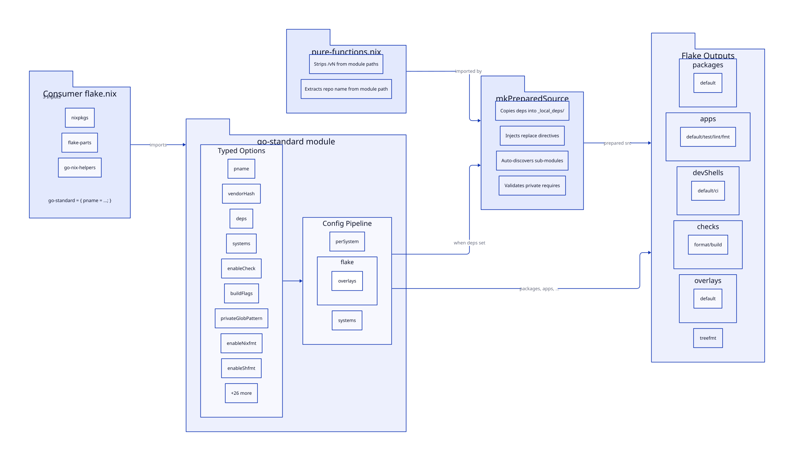

# go-nix-helpers

[](https://github.com/LarsArtmann/go-nix-helpers/actions/workflows/ci.yml)
[](https://opensource.org/licenses/MIT)
[](https://go.dev)
[](https://flake.parts)

**One flake-parts module. Three inputs. ~20 lines. Full Go packaging, dev shells, formatting, linting, CI, overlays, and private-dependency injection.**

Stop hand-writing the same `flake.nix` boilerplate for every Go repo. `go-nix-helpers` gives you a typed, batteries-included [`flake-parts`](https://flake.parts) module that turns a short config block into a complete developer and build environment — including the trickiest part: building Go projects that depend on private GitHub modules inside the Nix sandbox.

---

## Quick start

```nix
{
  description = "My project — what it does";

  inputs = {
    nixpkgs.url = "github:NixOS/nixpkgs/nixos-unstable";

    flake-parts = {
      url = "github:hercules-ci/flake-parts";
      inputs.nixpkgs-lib.follows = "nixpkgs";
    };

    go-nix-helpers = {
      url = "git+ssh://git@github.com/LarsArtmann/go-nix-helpers?ref=master";
      inputs.nixpkgs.follows = "nixpkgs";
    };
  };

  outputs = inputs@{ self, ... }:
    flake-parts.lib.mkFlake { inherit inputs; } {
      imports = [ inputs.go-nix-helpers.flakeModules.go-standard ];

      go-standard = {
        pname = "my-project";
        vendorHash = "sha256-AAAAAAAAAAAAAAAAAAAAAAAAAAAAAAAAAAAAAAAAAAA="; # run `nix build` to compute
        description = "What this project does";
      };
    };
}
```

That is the whole flake. `treefmt-nix` and `systems` are bundled inside the module, so you do not declare them as inputs.

After copying it in:

```bash
nix build      # produces the package
nix run        # runs the default app
nix develop    # enters the full dev shell
nix flake check # formats, builds, and runs checks
```

---

## What you get

| Output              | What it gives you                                        |
| ------------------- | -------------------------------------------------------- |
| `packages.default`  | Compiled binary via `buildGoModule` (Go 1.26)            |
| `packages.<pname>`  | Same package under its own name                          |
| `apps.fmt`         | `treefmt` wrapper (only if >=1 formatter enabled)       |
| `apps.default`      | `nix run .#<pname>`                                      |
| `apps.test`         | `go test -race -v ./...`                                 |
| `apps.lint`         | `golangci-lint run ./...`                                |
| `devShells.default` | Go + gopls + gofumpt + golangci-lint (+ optional extras) |
| `devShells.ci`      | Minimal CI shell                                         |
| `checks.format`     | `treefmt` formatting check                               |
| `checks.build`      | Package build verification                               |
| `overlays.default`  | Exposes `pkgs.<pname>` to other flakes                   |

`GOWORK = "off"` and `GOTOOLCHAIN = "local"` are set by default in every shell to keep the build deterministic.

---

## Private dependencies, solved

The Nix sandbox has no SSH and no network, so `go` cannot fetch private modules. `go-nix-helpers` solves this transparently:

```nix
go-standard = {
  pname = "my-project";
  vendorHash = "sha256-...";
  description = "What it does";

  deps = {
    "github.com/larsartmann/go-cqrs-lite" = inputs.go-cqrs-lite;
  };
  # Sub-modules are auto-discovered. GOPRIVATE is auto-injected.
  # Build fails with a clear message if a private require lacks a replace.
};
```

Add the dep as a `flake = false` input, list it in `deps`, and the module does the rest:

- Copies each dependency into `_local_deps/`
- Auto-discovers every sub-module at any depth (no manual `subModules` list)
- Injects `replace` directives into `go.mod`
- Strips stale absolute/relative replace directives
- Handles `/vN` major-version paths correctly
- Validates that every private `require` has a matching `replace`

If you need the lower-level helper directly, import `mkPreparedSource.nix` instead.

---

## Monorepo support

Build multiple binaries from a single repository:

```nix
go-standard = {
  pname = "my-project";
  vendorHash = "sha256-...";
  description = "What it does";

  packages = {
    server.subPackages = [ "cmd/server" ];
    worker.subPackages = [ "cmd/worker" ];
  };
};
```

This generates `packages.server`, `packages.worker` (plus `packages.default`),
separate `apps` for each, and all entries in the overlay.

---

## Before and after

| Concern              | Manual flake.nix                           | `go-standard` module                 |
| -------------------- | ------------------------------------------ | ------------------------------------ |
| Inputs required      | nixpkgs, flake-parts, treefmt-nix, systems | nixpkgs, flake-parts, go-nix-helpers |
| Lines to maintain    | ~80–120                                    | ~20                                  |
| Private deps         | Hand-rolled `mkPreparedSource` wiring      | One `deps` attrset                   |
| Sub-module discovery | Manual list                                | Automatic                            |
| Validation           | Cryptic SSH errors at build time           | Clear pre-build validation           |
| Formatting           | Manual `treefmt` wiring                    | Auto-configured                      |

---

## Configuration options

See the full option table below, or copy one of the [templates](#templates).

| Option                  | Default                      | Description                                                          |
| ----------------------- | ---------------------------- | -------------------------------------------------------------------- |
| `pname`                 | (required)                   | Package name, overlay attr, and `mainProgram`                        |
| `vendorHash`            | `null`                       | Vendor hash for `buildGoModule` (`null` = committed `vendor/`)       |
| `src`                   | `self.outPath`               | Source path (use `lib.fileset` to filter)                            |
| `description`           | `"A LarsArtmann Go project"` | Short description for package meta                                   |
| `version`               | `self.rev or "dev"`          | Version string (defaults to git revision)                            |
| `systems`               | `[x86_64-linux, ...]`        | Systems to build for (matches `nix-systems/default`)                 |
| `subPackages`           | `[ "." ]`                    | Subpackages to build                                                 |
| `goPkgAttr`             | `"go_1_26"`                  | Go package attribute in nixpkgs                                      |
| `goPkgOverride`         | identity                     | Function applied to the Go package (custom toolchains, e.g. newer patch version) |
| `lintAsCheck`           | `false`                      | Also expose golangci-lint as a hermetic `checks.lint` derivation (for CI) |
| `enableCheck`           | `true`                       | Run `go test` during the Nix build (`doCheck`)                       |
| `enableOverlay`         | `true`                       | Generate `flake.overlays.default`                                    |
| `enableTempl`           | `false`                      | Include `templ` in devShells and treefmt                             |
| `enableGovulncheck`     | `true`                       | Include `govulncheck` in the default devShell                        |
| `enableGopls`           | `true`                       | Include `gopls` in the default devShell                              |
| `enableGolangciLint`    | `true`                       | Include `golangci-lint` in devShells and the lint app                |
| `enableGofumpt`         | `true`                       | Enable `gofumpt` in treefmt programs                                 |
| `enableGoimports`       | `true`                       | Enable `goimports` in treefmt programs                               |
| `enableNixfmt`          | `true`                       | Enable `nixfmt` in treefmt programs                                  |
| `enableShfmt`           | `false`                      | Enable `shfmt` in treefmt programs                                   |
| `enableCompletions`     | `false`                      | Install shell completions (requires cobra/urfave/cli; warns if unsupported) |
| `buildFlags`            | `[]`                         | Extra build flags for `go build` (e.g. build tags)                   |
| `packages`              | `{}`                         | Additional packages for monorepo support                             |
| `deps`                  | `{}`                         | Private Go deps for `mkPreparedSource`                               |
| `subModules`            | `{}`                         | Explicit sub-modules (merged with auto-discovered)                   |
| `postPatchExtra`        | `""`                         | Extra `postPatch` commands for `mkPreparedSource`                    |
| `autoGoPrivate`         | `true`                       | Auto-inject `GOPRIVATE` when deps are set                            |
| `privateGlobPattern`    | LarsArtmann globs            | GOPRIVATE glob pattern used by `autoGoPrivate`                       |
| `validatePrivateDeps`   | `true`                       | Fail build if a private `require` lacks a `replace`                  |
| `privateDepPattern`     | LarsArtmann regex            | ERE matching module paths that must have a `replace` directive       |
| `publicDeps`            | `[]`                         | Module paths excluded from validation only (does NOT affect GOPRIVATE) |
| `proxyVendor`           | `true`                       | Pass `proxyVendor` to `buildGoModule`                                |
| `ldflags`               | `null` (auto)                | Custom ldflags (`null` = `["-s" "-w" "-X main.version=${version}"]`) |
| `extraMeta`             | `{}`                         | Extra attributes merged into package meta                            |
| `extraBuildAttrs`       | `{}`                         | Extra attributes merged into `buildGoModule` (see merge rules below) |
| `devShellExtraPackages` | `_: []`                      | Function receiving `pkgs`, returns extra devShell packages           |
| `shellExtraEnv`         | `{}`                         | Extra env vars for devShells                                         |

#### `extraBuildAttrs` merge rules

Six attributes receive special **concatenation** handling when passed via
`extraBuildAttrs` — the user's values are appended to the module-generated
values rather than overriding them:

| Attribute             | Module value                             | User value appended? |
| --------------------- | ---------------------------------------- | -------------------- |
| `nativeBuildInputs`   | `templ`, `installShellFiles` (when enabled) | Yes                |
| `buildInputs`         | (module-generated)                       | Yes                  |
| `checkInputs`         | (module-generated)                       | Yes                  |
| `configureFlags`      | (module-generated)                       | Yes                  |
| `preBuild`            | Auto dep-sync hook                       | Yes                  |
| `postInstall`         | Completion install hook                  | Yes                  |

All other attributes override module defaults via the `//` operator.

---

## Lower-level helpers

### `mkPreparedSource.nix`

Use this when you want to wire `buildGoModule` yourself but still need private-dependency injection and sub-module auto-discovery.

```nix
mkPreparedSource = import (go-nix-helpers + "/mkPreparedSource.nix") {
  inherit pkgs lib;
  goPkg = pkgs.go_1_26;
};

preparedSrc = mkPreparedSource {
  name = "my-app";
  version = "1.0.0";
  src = ./.;
  deps = {
    "github.com/larsartmann/go-cqrs-lite" = go-cqrs-lite;
  };
};
```

| Parameter             | Default                             | Description                                         |
| --------------------- | ----------------------------------- | --------------------------------------------------- |
| `name`                | (required)                          | Derivation name prefix                              |
| `src`                 | (required)                          | Source derivation or path                           |
| `deps`                | (required)                          | Attrset of `{ "import/path" = flake-input; }`       |
| `version`             | `"dev"`                             | Version string                                      |
| `autoSubModules`      | `true`                              | Auto-discover sub-modules from dep source trees     |
| `subModules`          | `{}`                                | Explicit sub-modules (merged with auto-discovered)  |
| `requireDeps`         | `{}`                                | Manually inject `require` lines                     |
| `subModuleVersion`    | `"v0.0.0"`                          | Version for pseudo-version normalization            |
| `stripLocalReplaces`  | `true`                              | Strip stale `replace X => /home/...` directives     |
| `validatePrivateDeps` | `true`                              | Verify every private `require` has a `replace`      |
| `privateDepPattern`   | `"github\\.com/[Ll]ars[Aa]rtmann/"` | ERE regex matching private module paths to validate |
| `publicDeps`          | `[]`                                | Module paths excluded from private validation (versioned-path aware: base path matches `/v2`, `/v3`, etc.) |
| `postPatchExtra`      | `""`                                | Additional shell commands appended to `postPatch`   |

### `mkGoFlake.nix` (deprecated)

> **⚠️ Deprecated.** Use `flakeModules.go-standard` instead. See the
> [migration guide](docs/migration-guide.md) for step-by-step instructions.

The function-based predecessor to `flakeModules.go-standard`. Kept for backwards compatibility; emits a deprecation warning on use.

---

## Templates

| Template                                                                   | Use when...                                                              |
| -------------------------------------------------------------------------- | ------------------------------------------------------------------------ |
| [`templates/go-standard/flake.nix`](templates/go-standard/flake.nix)       | Starting a new project — recommended, minimal setup                      |
| [`templates/go-flake-parts/flake.nix`](templates/go-flake-parts/flake.nix) | ⚠️ **Deprecated.** Old 5-input manual pattern. Migrate to `go-standard`. |

---

## Architecture



The consumer flake imports `go-standard`, which evaluates typed options and
generates standard flake outputs. When `deps` is set, `mkPreparedSource`
handles private-dependency injection automatically.

---

## Troubleshooting / FAQ

### "go: module github.com/larsartmann/...: reading ... 410 Gone" or SSH errors

The Nix sandbox has no network access. You need to add private deps as flake
inputs and list them in `deps`:

```nix
go-standard = {
  deps = {
    "github.com/larsartmann/go-cqrs-lite" = inputs.go-cqrs-lite;
  };
};
```

And add the dep as a `flake = false` input:

```nix
go-cqrs-lite = {
  url = "git+ssh://git@github.com/LarsArtmann/go-cqrs-lite?ref=master";
  flake = false;
};
```

### "modules without local replace" build error

This is the build-time validation catching a missing dep. Every private
`require` in `go.mod` that matches `privateDepPattern` must have a matching
entry in `deps`. Options:

1. **Add the missing dep** as a flake input and list it in `deps` (if private)
2. **Set `validatePrivateDeps = false`** (if all matching deps are public)
3. **Add the module path to `publicDeps`** (if some are public, others private)

```nix
go-standard = {
  publicDeps = [ "github.com/larsartmann/go-atomic-write" ];
};
```

Note: `publicDeps` is versioned-path aware. Listing `github.com/larsartmann/go-atomic-write`
also excludes `github.com/larsartmann/go-atomic-write/v2`, `/v3`, etc.

### vendorHash mismatch after adding deps

Run `nix build` once and copy the `got: sha256-...` hash from the error into
`vendorHash`. The module changes how deps are prepared, so the hash differs
from a plain `buildGoModule`.

### "GOPRIVATE not set" / Go tries to reach the proxy for private modules

The module auto-injects `GOPRIVATE` when `deps` is set. By default (when
`publicDeps` is empty), it uses the broad glob
`github.com/larsartmann/*,github.com/LarsArtmann/*`. When `publicDeps` is
set, it switches to specific dep paths so public repos fetch via the proxy.
If you need a different pattern, override via:

```nix
go-standard.shellExtraEnv.GOPRIVATE = "your-pattern/*";
```

### How do I use a committed `vendor/` directory?

Set `vendorHash = null` (which is the default). This tells `buildGoModule`
that you have a committed `vendor/` directory and it should not compute a
hash. Make sure `vendor/` is up to date (`go mod vendor`) and not
`.gitignore`-d.

```nix
go-standard = {
  vendorHash = null;  # committed vendor/
};
```

### How does vendorHash work with monorepos?

All packages in the `packages` option share a single `vendorHash`. This is
correct because they share the same `go.mod` and vendor directory. If you
update dependencies, run `nix build` once to recompute the hash, then update
`vendorHash` for all packages.

### How do I use a different Go toolchain?

`GOTOOLCHAIN = "local"` is set by default in all devShells to prevent Go
from downloading newer toolchains. To allow Go toolchain downloads:

```nix
go-standard.shellExtraEnv.GOTOOLCHAIN = "auto";  # or a specific version
```

### How do I disable the Nix build check (go test)?

```nix
go-standard.enableCheck = false;
```

### How do I override the systems list?

```nix
go-standard.systems = [ "x86_64-linux" ];  # Linux only
# Or use a systems input:
# go-standard.systems = import inputs.systems;
```

### How do I add build tags?

```nix
go-standard.buildFlags = [ "-tags" "production" ];
```

### How do I disable Nix formatting (nixfmt)?

```nix
go-standard.enableNixfmt = false;
```

This removes nixfmt from treefmt while keeping gofumpt and goimports. To
disable all formatting, set `enableGofumpt = false; enableGoimports = false;
enableNixfmt = false;`. When no formatters are enabled, the `apps.fmt`
output is omitted.

To enable shell script formatting alongside Nix formatting:

```nix
go-standard.enableShfmt = true;
```

### How do I use deps with non-LarsArtmann repos?

The defaults (`privateDepPattern`, `privateGlobPattern`) are LarsArtmann-specific.
For other organizations, override both:

```nix
go-standard = {
  privateDepPattern = "github\\.com/myorg/";
  privateGlobPattern = "github.com/myorg/*,github.com/MyOrg/*";
  deps = {
    "github.com/myorg/my-private-lib" = inputs.my-private-lib;
  };
};
```

For mixed-owner deps (some LarsArtmann, some external), add the external
private repos to `deps` and override `privateDepPattern` to match both
organizations (e.g. `"github\\.com/(myorg|otherorg)/"`).

---

## Development

```bash
nix flake check                    # all checks (autoDiscovery, explicitOnly, verify, moduleTest, treefmt)
nix build .#verifyValidation       # build the validation test runner
nix run .#verifyValidation         # run the negative-case validation outside the sandbox
nix fmt                            # format all .nix files
```

See [`CONTRIBUTING.md`](CONTRIBUTING.md) for the development guide.

---

## Related projects

Used across LarsArtmann Go repositories including `go-structure-linter`, `go-output`, `go-atomic-write`, `gogenfilter`, and `samber-do-auditlog`.

See [`docs/flake-patterns.md`](docs/flake-patterns.md) for detailed patterns and anti-patterns when writing flake.nix files for Go projects.
