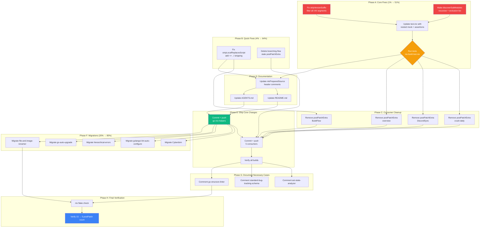

# Eliminate postPatch/postPatchExtra Workarounds via mkPreparedSource Root-Cause Fixes

**Date**: 2026-06-29
**Status**: COMPLETE
**Owner**: Crush + Lars

---

## Context

An audit of all ~95 `flake.nix` files found **15 `postPatch`/`postPatchExtra` instances** across 14 projects. ~60% of these are symptoms of 3 fixable gaps in `go-nix-helpers/mkPreparedSource.nix`. The rest are genuinely necessary edge cases.

The core problem: `buildGoModule` does NOT support `go.work` — it builds from a flat `go.mod` with `replace` directives. `mkPreparedSource` is the correct abstraction for making multi-repo Go projects build in the Nix sandbox. But it has gaps that force consumers to hand-write `postPatchExtra` workarounds.

## Root Causes

| #   | Gap                                                           | Location                       | Forces workarounds in              |
| --- | ------------------------------------------------------------- | ------------------------------ | ---------------------------------- |
| 1   | `stripVersionSuffix` only strips TRAILING `/vN`, not mid-path | `mkPreparedSource.nix:94-100`  | crush-daily, DiscordSync, overview |
| 2   | `discoverSubModules` scans depth-1 only                       | `mkPreparedSource.nix:136-156` | crush-daily, DiscordSync, overview |
| 3   | `stripLocalReplacesScript` misses `=> ../` relative paths     | `mkPreparedSource.nix:229-232` | BuildFlow                          |
| 4   | branching-flow strips phantom enum/envdetect (dead code)      | `branching-flow/flake.nix:117` | branching-flow                     |

## Pareto Breakdown

### 1% → 51%: Fix stripVersionSuffix + recursive discoverSubModules

The single root-cause fix. Changes 2 functions in `mkPreparedSource.nix`:

1. **`stripVersionSuffix`**: Change from "strip trailing `/vN`" to "filter ALL `/vN` segments"
   - `event/v3/eventtest` → `event/eventtest` (currently broken)
   - `codec/v2` → `codec` (currently works)
   - `github.com/.../go-filewatcher/v2` → `github.com/.../go-filewatcher` (currently works)

2. **`discoverSubModules`**: Walk the dep tree recursively instead of depth-1 only
   - Add exclusion list: `["example" "examples" "testdata" ".git" "vendor"]`
   - Read actual filesystem path for `localDir` (not derived from module path)
   - Discover ALL nested `go.mod` files at any depth

**Eliminates**: 3 `postPatchExtra` blocks (crush-daily, DiscordSync, overview)

### 4% → 64%: Fix stripLocalReplacesScript + delete dead code

3. **`stripLocalReplacesScript`**: Add `sed -i '/=> \.\.\//d' go.mod` to strip sibling-dir relative replaces
4. **branching-flow**: Delete stale `postPatchExtra` (phantom enum/envdetect lines that don't exist)

**Eliminates**: 2 more instances (BuildFlow, branching-flow) — **total 5 of 15**

### 20% → 80%: Migrate 5 manual-postPatch projects to mkPreparedSource

5. hierarchical-errors — manual preparedSrc → `deps = {}`
6. go-auto-upgrade — manual preparedSrc → `deps = {}`
7. golangci-lint-auto-configure — inline echo replaces → `deps = {}`
8. file-and-image-renamer — localReplaces var → `deps = {}` + `subModules = {}`
9. Cyberdom — hand-written replace block → `subModules = {}`

**Eliminates**: 5 more instances — **total 10 of 15**

### Remaining 20%: Keep + document (5 genuinely necessary)

- **ast-state-analyzer** (×2): Stripping local replace loses go.sum entries. Must manually append hashes. Fundamental limitation.
- **standard-bug-tracking-schema**: Auth setup (NETRC, git-credentials). Orthogonal concern.
- **monitor365**: Rust/WASM wasm-opt incompatibility. Not Go.
- **go-structure-linter**: Multi-module repo needs replaces in EACH sub-module's go.mod. Different abstraction needed.

---

## Level 1: Coarse Task Breakdown (30–100 min each)

| #   | Priority | Task                                                                | Est   | Depends On |
| --- | -------- | ------------------------------------------------------------------- | ----- | ---------- |
| 1   | P0       | Fix `stripVersionSuffix` to filter all `/vN` segments               | 30min | —          |
| 2   | P0       | Make `discoverSubModules` recursive with exclusion list             | 60min | —          |
| 3   | P0       | Update test.nix: add nested eventtest-like mock + mid-path /vN test | 30min | 1,2        |
| 4   | P0       | Run `nix-build test.nix -A verify` to verify core fixes             | 15min | 3          |
| 5   | P1       | Fix `stripLocalReplacesScript` to strip `=> ../` paths              | 15min | —          |
| 6   | P0       | Remove `postPatchExtra` from crush-daily                            | 30min | 4          |
| 7   | P0       | Remove `postPatchExtra` from DiscordSync                            | 30min | 4          |
| 8   | P0       | Remove `postPatchExtra` from overview                               | 30min | 4          |
| 9   | P1       | Remove `postPatchExtra` from BuildFlow                              | 15min | 5          |
| 10  | P1       | Delete stale `postPatchExtra` from branching-flow                   | 15min | —          |
| 11  | P0       | Update mkPreparedSource.nix header comments                         | 15min | 1,2,5      |
| 12  | P0       | Update go-nix-helpers README.md                                     | 30min | 1,2,5      |
| 13  | P0       | Update go-nix-helpers AGENTS.md                                     | 15min | 1,2        |
| 14  | P0       | Commit + push go-nix-helpers changes                                | 15min | 4,11,12,13 |
| 15  | P0       | Commit + push crush-daily, DiscordSync, overview changes            | 30min | 6,7,8,14   |
| 16  | P0       | Commit + push BuildFlow, branching-flow changes                     | 15min | 9,10,14    |
| 17  | P0       | Verify builds: `nix build` on all 5 modified consumers              | 60min | 15,16      |
| 18  | P2       | Migrate Cyberdom to use subModules (simplest manual-postPatch)      | 60min | 14         |
| 19  | P2       | Migrate golangci-lint-auto-configure to mkPreparedSource deps       | 60min | 14         |
| 20  | P2       | Migrate hierarchical-errors to mkPreparedSource deps                | 90min | 14         |
| 21  | P2       | Migrate go-auto-upgrade to mkPreparedSource deps                    | 90min | 14         |
| 22  | P2       | Migrate file-and-image-renamer to mkPreparedSource deps             | 90min | 14         |
| 23  | P3       | Add explanatory comments to 4 genuinely-necessary postPatch cases   | 30min | 17         |
| 24  | P0       | Final verification: nix flake check on go-nix-helpers               | 15min | all        |

**Total estimated: ~16 hours**

---

## Level 2: Fine Task Breakdown (max 15 min each)

### Phase A: Core mkPreparedSource fixes (Tasks 1–4)

| #   | Task                                                                      | Est   | L1# |
| --- | ------------------------------------------------------------------------- | ----- | --- |
| A1  | Read current `stripVersionSuffix` implementation (lines 92-100)           | 2min  | 1   |
| A2  | Implement filter-based `stripVersionSuffix` (filter all v[0-9]+ segments) | 5min  | 1   |
| A3  | Verify with `nix eval` that `event/v3/eventtest` → `event/eventtest`      | 3min  | 1   |
| A4  | Read current `discoverSubModules` implementation (lines 130-161)          | 5min  | 2   |
| A5  | Design recursive walk function with exclusion list                        | 10min | 2   |
| A6  | Implement recursive `discoverSubModules`                                  | 10min | 2   |
| A7  | Fix `localDir` to use actual filesystem path (not stripVersionSuffix)     | 5min  | 2   |
| A8  | Verify `builtins.readDir` recursion works on Nix store paths              | 5min  | 2   |
| A9  | Read current test.nix mock dep structure                                  | 3min  | 3   |
| A10 | Add nested `event/v3/eventtest`-like mock to test.nix                     | 10min | 3   |
| A11 | Add mid-path /vN strip test assertion to verify script                    | 5min  | 3   |
| A12 | Add depth-2 discovery test assertion to verify script                     | 5min  | 3   |
| A13 | Run `nix-build test.nix -A verify -o result-verify && ./result-verify`    | 10min | 4   |
| A14 | Fix any test failures                                                     | 10min | 4   |

### Phase B: stripLocalReplacesScript fix + dead code (Tasks 5,10)

| #   | Task                                                                    | Est  | L1# |
| --- | ----------------------------------------------------------------------- | ---- | --- |
| B1  | Read current `stripLocalReplacesScript` (lines 228-232)                 | 2min | 5   |
| B2  | Add `sed -i '/=> \.\.\//d' go.mod` line                                 | 3min | 5   |
| B3  | Read branching-flow postPatchExtra (lines 116-119)                      | 2min | 10  |
| B4  | Verify enum/envdetect don't exist in go-output or branching-flow go.mod | 5min | 10  |
| B5  | Delete the stale postPatchExtra block                                   | 3min | 10  |

### Phase C: Consumer cleanup — remove postPatchExtra (Tasks 6–9)

| #   | Task                                            | Est   | L1# |
| --- | ----------------------------------------------- | ----- | --- |
| C1  | Read crush-daily postPatchExtra (lines 58-67)   | 3min  | 6   |
| C2  | Delete crush-daily postPatchExtra block         | 3min  | 6   |
| C3  | Build crush-daily: `nix build .#`               | 10min | 6   |
| C4  | Read DiscordSync postPatchExtra (lines 132-138) | 3min  | 7   |
| C5  | Delete DiscordSync postPatchExtra block         | 3min  | 7   |
| C6  | Build DiscordSync: `nix build .#`               | 10min | 7   |
| C7  | Read overview postPatchExtra (lines 174-180)    | 3min  | 8   |
| C8  | Delete overview postPatchExtra block            | 3min  | 8   |
| C9  | Build overview: `nix build .#`                  | 10min | 8   |
| C10 | Read BuildFlow postPatchExtra (lines 179-183)   | 3min  | 9   |
| C11 | Delete BuildFlow postPatchExtra block           | 3min  | 9   |
| C12 | Build BuildFlow: `nix build .#`                 | 10min | 9   |

### Phase D: Documentation (Tasks 11–13)

| #   | Task                                                                  | Est   | L1# |
| --- | --------------------------------------------------------------------- | ----- | --- |
| D1  | Update mkPreparedSource.nix header (recursive discovery mention)      | 10min | 11  |
| D2  | Update mkPreparedSource.nix parameter docs (add excludeSubModuleDirs) | 5min  | 11  |
| D3  | Update README.md: "Major version suffixes" section                    | 10min | 12  |
| D4  | Update README.md: "Auto-discovery" section (mention recursion)        | 10min | 12  |
| D5  | Update README.md: add "stripLocalReplaces" relative-path mention      | 5min  | 12  |
| D6  | Update AGENTS.md: /vN handling bullet                                 | 5min  | 13  |

### Phase E: Commits + pushes (Tasks 14–17)

| #   | Task                                                 | Est   | L1# |
| --- | ---------------------------------------------------- | ----- | --- |
| E1  | Git diff review of go-nix-helpers changes            | 5min  | 14  |
| E2  | Commit go-nix-helpers with detailed message          | 5min  | 14  |
| E3  | Push go-nix-helpers                                  | 2min  | 14  |
| E4  | Commit + push crush-daily                            | 5min  | 15  |
| E5  | Commit + push DiscordSync                            | 5min  | 15  |
| E6  | Commit + push overview                               | 5min  | 15  |
| E7  | Commit + push BuildFlow                              | 5min  | 16  |
| E8  | Commit + push branching-flow                         | 5min  | 16  |
| E9  | Verify all 5 consumers build: `nix build .#` on each | 15min | 17  |

### Phase F: Migrate manual-postPatch projects (Tasks 18–22)

| #   | Task                                                        | Est   | L1# |
| --- | ----------------------------------------------------------- | ----- | --- |
| F1  | Read Cyberdom flake.nix postPatch block (lines 122-131)     | 3min  | 18  |
| F2  | Read Cyberdom flake inputs and deps structure               | 5min  | 18  |
| F3  | Convert Cyberdom postPatch to subModules config             | 10min | 18  |
| F4  | Build Cyberdom: `nix build .#` (may need vendorHash update) | 15min | 18  |
| F5  | Commit + push Cyberdom                                      | 5min  | 18  |
| F6  | Read golangci-lint-auto-configure postPatch (lines 97-100)  | 3min  | 19  |
| F7  | Read golangci-lint-auto-configure flake inputs              | 5min  | 19  |
| F8  | Convert to mkPreparedSource deps map                        | 10min | 19  |
| F9  | Build + fix vendorHash                                      | 15min | 19  |
| F10 | Commit + push golangci-lint-auto-configure                  | 5min  | 19  |
| F11 | Read hierarchical-errors postPatch (lines 80-100)           | 5min  | 20  |
| F12 | Read hierarchical-errors flake structure                    | 5min  | 20  |
| F13 | Convert preparedSrc to mkPreparedSource call                | 15min | 20  |
| F14 | Build + fix vendorHash                                      | 15min | 20  |
| F15 | Commit + push hierarchical-errors                           | 5min  | 20  |
| F16 | Read go-auto-upgrade postPatch (lines 96-114)               | 5min  | 21  |
| F17 | Read go-auto-upgrade flake structure                        | 5min  | 21  |
| F18 | Convert preparedSrc to mkPreparedSource call                | 15min | 21  |
| F19 | Build + fix vendorHash                                      | 15min | 21  |
| F20 | Commit + push go-auto-upgrade                               | 5min  | 21  |
| F21 | Read file-and-image-renamer localReplaces (lines 71-90)     | 5min  | 22  |
| F22 | Read file-and-image-renamer flake structure                 | 5min  | 22  |
| F23 | Convert localReplaces to mkPreparedSource deps + subModules | 15min | 22  |
| F24 | Build + fix vendorHash                                      | 15min | 22  |
| F25 | Commit + push file-and-image-renamer                        | 5min  | 22  |

### Phase G: Document genuinely-necessary cases (Task 23)

| #   | Task                                                                      | Est  | L1# |
| --- | ------------------------------------------------------------------------- | ---- | --- |
| G1  | Add comment to ast-state-analyzer postPatch explaining go.sum workaround  | 5min | 23  |
| G2  | Add comment to standard-bug-tracking-schema postPatch explaining auth     | 5min | 23  |
| G3  | Note monitor365 postPatch is Rust/WASM (already documented inline)        | 2min | 23  |
| G4  | Add comment to go-structure-linter postPatchExtra explaining multi-module | 5min | 23  |

### Phase H: Final verification (Task 24)

| #   | Task                                                            | Est   | L1# |
| --- | --------------------------------------------------------------- | ----- | --- |
| H1  | Run `nix flake check` on go-nix-helpers                         | 10min | 24  |
| H2  | Run `nix-build test.nix -A verify` one final time               | 10min | 24  |
| H3  | Grep for remaining postPatch/postPatchExtra across all projects | 5min  | 24  |
| H4  | Verify count reduced from 15 to 5 (genuinely necessary only)    | 5min  | 24  |

**Total Level 2 tasks: 75**
**Total estimated: ~14 hours**

---

## Execution Graph



---

## Key Implementation Details

### stripVersionSuffix fix

```nix
# BEFORE (only strips trailing /vN):
stripVersionSuffix = path:
  let parts = lib.splitString "/" path; last = lib.last parts; in
  if builtins.match "v[0-9]+" last != null
  then lib.concatStringsSep "/" (lib.init parts) else path;

# AFTER (filters ALL /vN segments):
stripVersionSuffix = path:
  let parts = lib.splitString "/" path; in
  lib.concatStringsSep "/"
    (lib.filter (p: builtins.match "v[0-9]+" p == null) parts);
```

### Recursive discoverSubModules

```nix
# New exclusion parameter
excludeSubModuleDirs ? [ "example" "examples" "testdata" ".git" "vendor" ]

# Recursive walk
discoverSubModules = depPath: depSrc:
  if !autoSubModules then [ ] else
  let
    walk = dir:
      let
        entries = builtins.readDir dir;
        dirs = lib.filterAttrsToList (n: t: t == "directory" && !(lib.elem n excludeSubModuleDirs)) entries;
        subs = lib.flatten (map (d: walk "${dir}/${d}") dirs);
      in
      if builtins.pathExists "${dir}/go.mod" && dir != toString depSrc then
        [ (lib.removePrefix (toString depSrc + "/") dir) ] ++ subs
      else subs;
    found = walk depSrc;
    basename = repoName depPath;
  in map (rel: {
    modulePath = readModulePath "${depSrc}/${rel}/go.mod";
    localDir = "./_local_deps/${basename}/${rel}";
  }) found;
```

### stripLocalReplacesScript fix

```nix
# Add one line:
sed -i '/=> \.\.\//d' go.mod   # strip sibling-dir relative replaces
```
