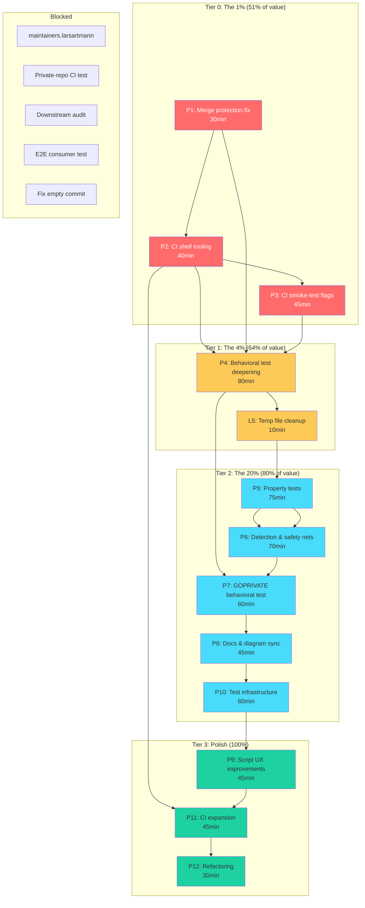

# Pareto Execution Plan — 2026-08-10 02:41

> Point-in-time snapshot. Living tasks live in `TODO_LIST.md`. This plan ranks
> all 30 actionable TODOs (+ 5 blocked) by the Pareto principle and breaks them
> into work packages and atomic tasks.

---

## Pareto Breakdown

### The 1% that delivers 51% of the result

Three tasks that prevent **real bugs** from hitting the 7+ downstream consumers.
If you do nothing else, do these.

| #  | Task                                       | Why it's the 1%                                                                                         | Effort |
| -- | ------------------------------------------ | ------------------------------------------------------------------------------------------------------- | ------ |
| H3 | Extend merge protection to all list attrs  | **Silent override bug.** Consumer's `buildInputs`/`checkInputs`/`configureFlags` silently override the module's list instead of concatenating. This can break consumer builds today — a consumer adding `extraBuildAttrs.buildInputs = [ pkgs.sqlite ]` unknowingly drops `pkgs.go` from the derivation. | 30min  |
| H4 | Add `shellcheck` to CI                     | `generate-flake.sh` is the **first thing new consumers run**. Shell bugs = bad first impression. The script has 100+ lines with no linting. One unquoted variable in a path with spaces = build failure for a user with spaces in their project dir. | 20min  |
| H1 | CI smoke-test for `--go-mod`/`--private-deps` | These flags **shipped without CI coverage**. Only manually verified once. A regression in the script would go unnoticed until a user hits it. | 30min  |

**Total: 80min for 51% of the value.** These are all low-effort correctness fixes
on code paths consumers actively use.

### The 4% that delivers 64% of the result

Add these four tasks to fill the highest-risk known gaps:

| #  | Task                                       | Why it's the 4%                                                                                         | Effort |
| -- | ------------------------------------------ | ------------------------------------------------------------------------------------------------------- | ------ |
| H5 | Add `shfmt` to treefmt                     | Professional formatting baseline. Without it, `shellcheck` will fight unformatted scripts. Must precede H4 for clean CI. | 20min  |
| M7 | Behavioral tests: buildFlags/ldflags/proxyVendor | Proves the **core value proposition** — that consumer config actually reaches `buildGoModule`. Currently only `nativeBuildInputs` has a behavioral test; the other critical attrs are eval-only. | 60min  |
| M9 | publicDeps `/v2` versioned paths test      | Known gap: `grep -vFx` exact match means `publicDeps = ["github.com/foo/bar"]` won't match `github.com/foo/bar/v2` in go.mod. Consumers using versioned modules get false-positive validation failures. | 20min  |
| L5 | Temp file cleanup in trap                  | `collectMissingRequires` creates a temp file that leaks on build failure. In practice the Nix sandbox is discarded, but a trap is 10min of insurance. | 10min  |

**Total: 110min additional (190min cumulative) for 64% of the value.**

### The 20% that delivers 80% of the result

The remaining High + Medium items — fill all test gaps and update stale docs:

| #   | Task                                      | Impact summary                              | Effort |
| --- | ----------------------------------------- | ------------------------------------------- | ------ |
| H2  | Behavioral test for GOPRIVATE with custom `privateGlobPattern` | Option-to-output flow untested | 60min  |
| M1  | Property test: `stripVersionSuffix`       | Pure function, only example-tested          | 30min  |
| M2  | Property test: `repoName`                  | Pure function, only example-tested          | 30min  |
| M3  | `vendorHash` placeholder detection         | Warn if consumer forgot to set real hash    | 30min  |
| M4  | `nix flake show` structural test           | Verify all expected outputs exist           | 30min  |
| M5  | Update `docs/architecture.d2`              | Diagram doesn't show `privateGlobPattern`/`enableNixfmt` | 20min  |
| M6  | `--dry-run` flag for `generate-flake.sh`   | Preview without writing                     | 20min  |
| M8  | Negative test for `enableCompletions`      | Warning path untested                       | 30min  |
| M10 | `treefmt.config` inspection test           | Treefmt config not verified in tests        | 30min  |

**Total: 280min additional (470min cumulative) for 80% of the value.**

### The remaining 20% (polish to reach 100%)

All Low-impact items:

| #   | Task                                      | Effort |
| --- | ----------------------------------------- | ------ |
| L1  | `--verbose` flag for generate-flake.sh    | 15min  |
| L2  | macOS CI badge in README                  | 10min  |
| L3  | `--template` listing in help text         | 10min  |
| L4  | FAQ entry for mixed-owner deps            | 15min  |
| L6  | `stripVersionSuffix` edge case tests      | 15min  |
| L7  | `nix flake check --all-systems` in CI     | 15min  |
| L8  | Cache nix-store in smoke-test CI job      | 15min  |
| L9  | Run integration tests on macOS            | 30min  |
| L10 | Extract `postPatch` to separate `.sh`     | 30min  |

**Total: 155min additional (625min cumulative) for 100% coverage.**

### Blocked (external dependencies)

| Task                                      | Blocker                           |
| ----------------------------------------- | --------------------------------- |
| Register `maintainers.larsartmann` in nixpkgs | External PR to nixpkgs        |
| Real private-repo integration test in CI  | Needs SSH key secret              |
| Audit all downstream consumers            | Needs access to 7+ repos          |
| Real e2e consumer test                    | Needs mock Go project + full build |
| Fix empty commit `df9a5ff`                | Needs interactive rebase + force push |

---

## Comprehensive Plan — Medium Granularity (30–100min per package)

Sorted by impact/effort ratio (highest first). Each package is independently
shippable as a single commit.

| Pkg  | Name                              | Tasks     | Pareto Tier | Total Effort | Customer Value                                                                                                                                                                                                          |
| ---- | --------------------------------- | --------- | ----------- | ------------ | ----------------------------------------------------------------------------------------------------------------------------------------------------------------------------------------------------------------------- |
| P1   | **Merge protection fix**          | H3        | 1% (51%)    | 30min        | **CRITICAL BUG FIX.** Consumer `buildInputs`/`checkInputs`/`configureFlags` silently override module defaults today. Extending concatenation to these attrs prevents broken consumer builds. Highest impact/effort ratio. |
| P2   | **CI shell tooling**              | H5, H4    | 1% (51%)    | 40min        | Add `shfmt` (formatting) then `shellcheck` (linting) to CI. Professional baseline for the consumer-facing `generate-flake.sh`. Catches real shell bugs before users hit them.                                            |
| P3   | **CI smoke-test flags**           | H1, L8    | 1% (51%)    | 45min        | Add `--go-mod` and `--private-deps` variants to CI smoke-test job. Cache nix-store to speed it up. Prevents regression on shipped-but-untested flags.                                                                   |
| P4   | **Behavioral test deepening**     | M7, M9    | 4% (64%)    | 80min        | Extract actual `buildFlags`/`ldflags`/`proxyVendor` from derivation and assert. Test `publicDeps` with `/v2` paths. Proves core value proposition works, not just evaluates.                                            |
| P5   | **Pure function property tests**  | M1, M2, L6 | 20% (80%)  | 75min        | Property tests for `stripVersionSuffix` (idempotence, no `/vN` in output) and `repoName` (no `/`, deterministic). Plus edge cases (`v1`, `v100`, empty string). Catches pure-function regressions.                     |
| P6   | **Detection and safety nets**     | M3, M4, L5 | 20% (80%)  | 70min        | `vendorHash` placeholder detection (warn if `sha256-AAA...`), `nix flake show` structural test, temp file trap cleanup. Three safety nets that prevent common consumer mistakes.                                        |
| P7   | **GOPRIVATE behavioral test**     | H2        | 20% (80%)   | 60min        | Behavioral test proving `privateGlobPattern` value reaches devShell GOPRIVATE. Requires setting `deps` in test config to trigger full machinery.                                                                        |
| P8   | **Docs and diagram sync**         | M5, L2, L4 | 20% (80%)  | 45min        | Update `architecture.d2` for `privateGlobPattern`/`enableNixfmt`, add macOS CI badge, add FAQ for mixed-owner deps.                                                                                                     |
| P9   | **Script UX improvements**        | M6, L1, L3 | Polish     | 45min        | `--dry-run` flag (preview without writing), `--verbose` flag (show created files), `--template` listing in help text. Three UX polish items for `generate-flake.sh`.                                                     |
| P10  | **Test infrastructure**           | M8, M10   | 20% (80%)   | 60min        | Negative test for `enableCompletions` warning (mock binary), treefmt.config inspection test. Fills the last two test gaps.                                                                                              |
| P11  | **CI expansion**                  | L7, L9    | Polish      | 45min        | Add `--all-systems` to CI flake check, run integration tests on macOS (not just eval). Cross-platform confidence.                                                                                                       |
| P12  | **Refactoring**                   | L10       | Polish      | 30min        | Extract `postPatch` script from `mkPreparedSource` into separate `.sh` file. Reduces Nix string escaping complexity. **Risk: delicate escaping, test thoroughly.**                                                      |

**Total: 12 packages, 625min (~10.4h) of actionable work.**

---

## Detailed Breakdown — Fine Granularity (max 12min per task)

Each task below is atomic: one verifiable action, one test, or one edit. Tasks
within a package are ordered by dependency.

### P1: Merge protection fix (H3) — 4 tasks

| Task # | Action                                                            | Effort | Verification                        |
| ------ | ----------------------------------------------------------------- | ------ | ----------------------------------- |
| 1.1    | Read `userExtraBuildAttrs` merge logic in `go-standard.nix`       | 5min   | Understand current concat pattern   |
| 1.2    | Add `buildInputs`, `checkInputs`, `configureFlags` to concat list | 5min   | `nix flake check` passes            |
| 1.3    | Add test: `extraBuildAttrs.buildInputs` concatenates              | 10min  | `test-module.nix` assertion passes  |
| 1.4    | Add test: `extraBuildAttrs.checkInputs` concatenates              | 10min  | `test-module.nix` assertion passes  |

### P2: CI shell tooling (H5, H4) — 5 tasks

| Task # | Action                                                            | Effort | Verification                        |
| ------ | ----------------------------------------------------------------- | ------ | ----------------------------------- |
| 2.1    | Add `shfmt` to treefmt programs in `go-standard.nix`              | 5min   | `nix fmt` runs shfmt                |
| 2.2    | Run `nix fmt` to format all `.sh` files                           | 5min   | 0 changed files on second run       |
| 2.3    | Add `shellcheck` step to `.github/workflows/ci.yml`               | 5min   | YAML validates                      |
| 2.4    | Fix any shellcheck warnings in `generate-flake.sh`                | 10min  | shellcheck exits 0                  |
| 2.5    | Fix any shellcheck warnings in `dashboard.sh`, `nix-lint.sh`     | 10min  | shellcheck exits 0                  |

### P3: CI smoke-test flags (H1, L8) — 5 tasks

| Task # | Action                                                            | Effort | Verification                        |
| ------ | ----------------------------------------------------------------- | ------ | ----------------------------------- |
| 3.1    | Read current smoke-test job in `ci.yml`                           | 5min   | Understand existing test variants   |
| 3.2    | Add `--go-mod` variant: generate + verify `go.mod` + `main.go` exist | 10min | `nix-instantiate --parse` passes    |
| 3.3    | Add `--private-deps` variant: generate + verify deps section      | 10min  | `nix-instantiate --parse` passes    |
| 3.4    | Add nix-store caching (`actions/cache` or `magic-nix-cache`)      | 10min  | CI YAML validates                   |
| 3.5    | Add combined `--go-mod --private-deps --templ` variant            | 10min  | `nix-instantiate --parse` passes    |

### P4: Behavioral test deepening (M7, M9) — 8 tasks

| Task # | Action                                                            | Effort | Verification                        |
| ------ | ----------------------------------------------------------------- | ------ | ----------------------------------- |
| 4.1    | Read `nativeBuildInputs` behavioral test pattern in test-module   | 5min   | Understand extraction method        |
| 4.2    | Add test: `buildFlags` reaches derivation                         | 10min  | Assertion: flags present in `.buildFlags` |
| 4.3    | Add test: `ldflags` reaches derivation with version injection     | 10min  | Assertion: `-X main.version=` present |
| 4.4    | Add test: `proxyVendor` reaches derivation                        | 10min  | Assertion: attr correct             |
| 4.5    | Read `publicDeps` `grep -vFx` logic in `mkPreparedSource.nix`     | 5min   | Understand exact-match limitation   |
| 4.6    | Create test fixture: dep with `/v2` suffix in go.mod              | 10min  | Fixture parses                      |
| 4.7    | Add test: `publicDeps` with versioned path — verify behavior      | 10min  | Test result matches expectation     |
| 4.8    | Document the exact-match limitation in test comment               | 5min   | Comment is clear                    |

### P5: Pure function property tests (M1, M2, L6) — 7 tasks

| Task # | Action                                                            | Effort | Verification                        |
| ------ | ----------------------------------------------------------------- | ------ | ----------------------------------- |
| 5.1    | Read `stripVersionSuffix` implementation                          | 5min   | Understand input/output contract    |
| 5.2    | Add test: idempotence (strip twice = strip once)                  | 10min  | Assertion passes                    |
| 5.3    | Add test: no `/vN` segments in output for any input               | 10min  | Assertion passes                    |
| 5.4    | Read `repoName` implementation                                    | 5min   | Understand extraction logic         |
| 5.5    | Add test: no `/` in output                                        | 10min  | Assertion passes                    |
| 5.6    | Add test: deterministic (same input → same output)                | 10min  | Assertion passes                    |
| 5.7    | Add edge case tests: `v1`, `v100`, empty, single segment          | 10min  | All assertions pass                 |

### P6: Detection and safety nets (M3, M4, L5) — 7 tasks

| Task # | Action                                                            | Effort | Verification                        |
| ------ | ----------------------------------------------------------------- | ------ | ----------------------------------- |
| 6.1    | Read `vendorHash` option and `buildGoModule` call                 | 5min   | Understand where to add detection   |
| 6.2    | Add `vendorHash` placeholder warning (assert != "sha256-AAA...")  | 10min  | Test: placeholder triggers warning  |
| 6.3    | Add test for placeholder detection                                | 10min  | Assertion passes                    |
| 6.4    | Add `nix flake show` structural test (packages, apps, checks exist) | 10min | All expected outputs present        |
| 6.5    | Read `collectMissingRequires` temp file logic                     | 5min   | Understand leak path                |
| 6.6    | Add `trap "rm -f go.mod.requires.tmp" EXIT` to postPatch          | 5min   | `nix flake check` passes            |
| 6.7    | Verify temp file no longer leaks on simulated error               | 10min  | Manual verification                 |

### P7: GOPRIVATE behavioral test (H2) — 6 tasks

| Task # | Action                                                            | Effort | Verification                        |
| ------ | ----------------------------------------------------------------- | ------ | ----------------------------------- |
| 7.1    | Read `autoGoPrivateEnv` and `privateGlobPattern` option           | 5min   | Understand flow: option → env       |
| 7.2    | Design test config with `deps` + custom `privateGlobPattern`      | 10min  | Config evaluates                    |
| 7.3    | Set up mock dep source for test                                   | 10min  | Dep source exists                   |
| 7.4    | Add test: devShell contains `GOPRIVATE` with custom glob          | 10min  | Assertion: glob string present      |
| 7.5    | Add test: default glob used when `privateGlobPattern` not set     | 10min  | Assertion: default string present   |
| 7.6    | Verify full `nix flake check` passes with new tests               | 5min   | All checks pass                     |

### P8: Docs and diagram sync (M5, L2, L4) — 5 tasks

| Task # | Action                                                            | Effort | Verification                        |
| ------ | ----------------------------------------------------------------- | ------ | ----------------------------------- |
| 8.1    | Read `docs/architecture.d2` current content                       | 5min   | Understand diagram structure        |
| 8.2    | Add `privateGlobPattern` and `enableNixfmt` to diagram            | 10min  | `d2` renders without error          |
| 8.3    | Regenerate `docs/architecture.svg` from `.d2`                     | 5min   | SVG file updated                    |
| 8.4    | Add macOS CI badge to README badges section                       | 5min   | Badge renders in markdown preview   |
| 8.5    | Add FAQ entry: "How do I use deps with non-LarsArtmann repos?"    | 10min  | FAQ entry is clear and accurate     |

### P9: Script UX improvements (M6, L1, L3) — 6 tasks

| Task # | Action                                                            | Effort | Verification                        |
| ------ | ----------------------------------------------------------------- | ------ | ----------------------------------- |
| 9.1    | Read `generate-flake.sh` argument parsing                         | 5min   | Understand current flag handling    |
| 9.2    | Add `--dry-run` flag: print what would be created, don't write    | 10min  | `--dry-run` prints, creates nothing |
| 9.3    | Add `--verbose` flag: print created files after generation        | 10min  | `--verbose` lists files             |
| 9.4    | Add `--template` listing to help text                             | 5min   | `--help` shows available templates  |
| 9.5    | Add `--list-templates` convenience flag                           | 10min  | Prints `go-standard`, `go-flake-parts` |
| 9.6    | Verify all flags work together (`--dry-run --verbose --templ`)    | 5min   | Combined flags work                 |

### P10: Test infrastructure (M8, M10) — 6 tasks

| Task # | Action                                                            | Effort | Verification                        |
| ------ | ----------------------------------------------------------------- | ------ | ----------------------------------- |
| 10.1   | Read `enableCompletions` postInstall logic                        | 5min   | Understand warning path             |
| 10.2   | Design mock binary without `--completion` for test                | 10min  | Mock binary compiles                |
| 10.3   | Add test: warning emitted when binary lacks `--completion`        | 10min  | Assertion: warning text present     |
| 10.4   | Read treefmt config generation in `go-standard.nix`               | 5min   | Understand config structure         |
| 10.5   | Add test: verify treefmt programs match enabled options           | 10min  | All programs match                  |
| 10.6   | Verify `nix flake check` passes                                   | 5min   | All checks pass                     |

### P11: CI expansion (L7, L9) — 5 tasks

| Task # | Action                                                            | Effort | Verification                        |
| ------ | ----------------------------------------------------------------- | ------ | ----------------------------------- |
| 11.1   | Read CI matrix strategy                                           | 5min   | Understand current matrix           |
| 11.2   | Add `--all-systems` to CI flake check step                        | 5min   | YAML validates                      |
| 11.3   | Add integration test step to macOS job (remove `--no-build`)      | 10min  | YAML validates                      |
| 11.4   | Verify locally that integration tests would pass on macOS         | 10min  | Local eval passes                   |
| 11.5   | Document CI matrix changes in CHANGELOG                           | 5min   | Entry is accurate                   |

### P12: Refactoring (L10) — 4 tasks

| Task # | Action                                                            | Effort | Verification                        |
| ------ | ----------------------------------------------------------------- | ------ | ----------------------------------- |
| 12.1   | Read `postPatch` script in `mkPreparedSource.nix`                 | 5min   | Understand full script logic        |
| 12.2   | Extract to `scripts/post-patch.sh` with parameterized vars        | 10min  | Script is standalone-executable     |
| 12.3   | Wire `postPatch` to call the extracted script                     | 5min   | `nix flake check` passes            |
| 12.4   | Run full integration tests to verify no behavioral change         | 10min  | All 6 scenarios pass                |

---

## Execution Graph

---

## Risk Analysis (Verschlimmbesserung Prevention)

| Package | Risk                                                       | Mitigation                                                                 |
| ------- | ---------------------------------------------------------- | -------------------------------------------------------------------------- |
| P1      | Extending merge logic could break existing consumers       | Add tests BEFORE changing code; verify backward compat with `nativeBuildInputs` pattern |
| P2      | `shfmt` might reformat in ways that change script behavior | Run `shfmt` then manually `diff` — shell formatting is cosmetic            |
| P4      | Extracting derivation attrs might not work for all attrs   | Already proven for `nativeBuildInputs`; if others fail, document and skip  |
| P7      | Setting `deps` in test config triggers full mkPreparedSource machinery | Start with minimal dep mock; verify each step incrementally        |
| P12     | Extracting `postPatch` could break delicate shell escaping | **Highest risk package.** Run ALL 6 integration scenarios before and after. If ANY test fails, revert immediately. Do this LAST. |

---

## Summary Metrics

| Metric                    | Value         |
| ------------------------- | ------------- |
| Total actionable tasks    | 30            |
| Blocked tasks             | 5             |
| Total packages            | 12            |
| Total atomic sub-tasks    | 68            |
| Total effort              | 625min (~10.4h) |
| 1% tier (51% value)       | 80min (3 tasks) |
| 4% tier (64% value)       | 190min (7 tasks) |
| 20% tier (80% value)      | 470min (16 tasks) |
| 100% coverage             | 625min (30 tasks) |

---

_Arte in Aeternum_
