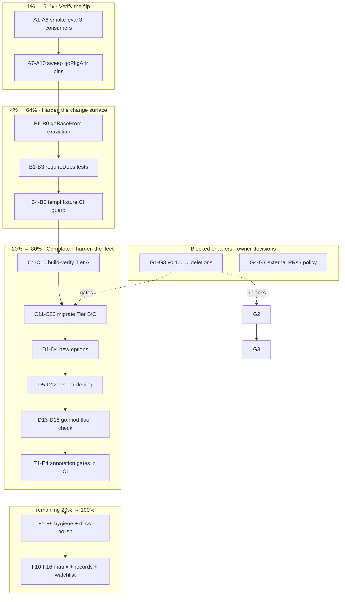

# Pareto Execution Plan — 2026-09-24 18:13

> **Scope:** ALL open TODOs from `TODO_LIST.md` (T1–T32, 5 Blocked, 1 rejected-on-merit) plus the
> deferred/external watchlist carried in the live status reports. Source snapshot: the
> 2026-09-24 docs-health audit (`docs/status/2026-09-24_18-06_docs-health-full-audit-annotate-archive.md`).
> **This plan ranks; `TODO_LIST.md` remains the living source.** New tasks surfaced by the audit
> were added there as T26–T32 before this plan was written.

---

## Context

go-nix-helpers is a Nix **library** consumed by 34 LarsArtmann Go repos (10 on the go-standard
module, ~22 legacy manual, 2 on deprecated `mkGoFlake`). The docs are now fully truthful (14
drifts repaired 2026-09-24; 23 old reports archived). The open work concentrates on four themes:

1. **The unverified default flip** — `goPkgAttr` auto-default shipped 2026-09-24 with ZERO
   consumer verification. Every consumer gets a toolchain jump (possible vendorHash mismatch) on
   next `flake.lock` update. Three separate reports call this the "biggest honest gap".
2. **The unfinished fleet migration** — 24/34 repos still on legacy patterns (audit's core
   finding). G2 unblocks all of Tier B/C.
3. **Coverage holes on shipped behavior** — `requireDeps` (zero tests), `goBase` (active split
   brain in the exact code the default flip touched), templ fixture (daemon already broke it once).
4. **Docs that still cannot rot-proof themselves** — hand-typed counts struck again this session;
   the annotation gates that saved the audit are session discipline, not CI.

**Non-goals:** re-implementing `buildGoModule`, non-Go projects, replacing flake-parts
(ROADMAP Non-goals). Do not verschlimmbessern: no speculative rewrites; every change leaves the
repo verifiably no worse.

---

## Pareto Breakdown

### The 1% that delivers 51% of the result

**Verify the shipped auto-default against the real fleet (T1 + T2).**
Why: the flake's entire value proposition is "consumers build reliably". The default flip is the
largest behavioral change in months, silently awaiting every consumer in their next lock update.
Proving 3 real consumers (eval + `nix build` + vendorHash intact) converts a triple-flagged
honest gap into evidence; sweeping the fleet's redundant `goPkgAttr` pins removes the confusion
the flip creates. ~105min total.

### The 4% that delivers 64% of the result

**Add the 1% + harden the change surface it just verified:**

- T6: `requireDeps` test assertions (option ships with zero coverage — verified by grep)
- T7: CI guard forbidding committed `*_templ.go` under the missing-generated fixture (the daemon
  re-added it once and turned moduleTest red — it WILL retry)
- T8: extract shared `goBase` resolution (active split brain: `modules/go-standard.nix:478` vs
  `mkGoFlake.nix:98` — the exact code T1 verifies)
  +90min cumulative.

### The 20% that delivers 80% of the result

**Complete and harden the fleet migration:**

- T3: build-verify the 10 eval-only Tier A migrations ("it evaluates" ≠ "it builds")
- T4 + T5: migrate Tier B (6 repos) and Tier C (2 repos) — closes the audit's core finding
- T13: `goExperiment`/`cgoEnabled`/`completionStyle` options (7/10 Tier A repos repeat
  GOEXPERIMENT boilerplate; cobra consumers need subcommand-style completions)
- T11/T12/T14/T15/T20/T21: test + UX hardening (throw-message assertion, ERE escaping,
  proxyVendor warning, templ in modBuildPhase, glob quoting, error-text assertion)
- T9/T10: `pkgs.go` fallback + mkGoFlake smoke coverage
- T16: eval-time go.mod floor check (converts the silent breaker class into an actionable error)
- T30 + T29: annotation gates as a flake check + exemption notes (make CI the drift-catcher)

### The remaining 20% (polish to reach 100%)

- T17–T19, T22, T23, T25: repo hygiene micro-fixes (symlinks, comments, warnings, patterns, dashboard)
- T26–T28: docs cosmetics from the audit (list-marker spacing, render-verify, groff check)
- T24: old-nixpkgs pinned matrix job
- T31/T32: records (0817f80 correction note, lock-bump postmortem)
- External/deferred watchlist: CV lock+vendorHash proof, SKILLS-repo follow-ups, x86_64-darwin
  warning root-cause, `passthru.go`, older-pin warning, flake-docs consolidation (dormant)
- Blocked enablers: v0.1.0 tag → mkGoFlake + template removal; maintainers nixpkgs PR; SSH CI
  test; df9a5ff fix; Won't-implement policy decision

---

## Comprehensive Plan (medium granularity — 30–100min tasks)

Sorted by importance / impact / effort / customer-value (fleet of 34 consumer repos = the customer).

| #   | Task                                                                                                                                                                | Pareto tier | Impact   | Effort | Covers                 |
| --- | ------------------------------------------------------------------------------------------------------------------------------------------------------------------- | ----------- | -------- | ------ | ---------------------- |
| P1  | Smoke-eval 3 real consumers (erraudit, PMA, go-auto-upgrade) against the auto default: `nix flake check --no-build` + `nix build` + vendorHash intact               | **1%**      | Critical | 60min  | T1                     |
| P2  | Sweep consumer fleet for redundant `goPkgAttr = "go_1_26"` pins; remove pin + eval-verify per repo                                                                  | **1%**      | High     | 45min  | T2                     |
| P3  | `requireDeps` test assertions (default, dedup path, forwarding) in `test-module.nix`                                                                                | **4%**      | High     | 30min  | T6                     |
| P4  | CI guard: fail when `*_templ.go` is committed under `test-assets/mock-templ-missing-generated/`                                                                     | **4%**      | High     | 30min  | T7                     |
| P5  | Extract `goBaseFrom` into `pure-functions.nix`; use from module + mkGoFlake; keep pureFunctions green                                                               | **4%**      | Med      | 30min  | T8                     |
| P6  | Build-verify Tier A repos 1–5 (`nix build`, update vendorHash where the proxyVendor flip bites)                                                                     | 20%         | High     | 90min  | T3 (a)                 |
| P7  | Build-verify Tier A repos 6–10 (same protocol; commit per repo)                                                                                                     | 20%         | High     | 90min  | T3 (b)                 |
| P8  | Migrate KeyCountdown + branching-flow to go-standard                                                                                                                | 20%         | High     | 80min  | T4 (a)                 |
| P9  | Migrate StopTube + overview to go-standard (G2 per-package attrs in anger)                                                                                          | 20%         | High     | 80min  | T4 (b)                 |
| P10 | Migrate bank-sync (allowUnfree pattern) + BuildFlow (largest, 1215 lines)                                                                                           | 20%         | High     | 100min | T4 (c)                 |
| P11 | Migrate Standup-Killer off deprecated mkGoFlake                                                                                                                     | 20%         | Med      | 60min  | T5 (a)                 |
| P12 | Migrate crush-daily off mkGoFlake (NixOS module via perSystem)                                                                                                      | 20%         | Med      | 60min  | T5 (b)                 |
| P13 | Add `goExperiment` (string), `cgoEnabled` (bool), `completionStyle` (enum) options + tests + docs                                                                   | 20%         | High     | 90min  | T13                    |
| P14 | Harden negative tests: templ-committed asserts throw MESSAGE + verifyValidation asserts error text                                                                  | 20%         | Med      | 45min  | T11+T21                |
| P15 | Escape ERE metachars in `publicDeps` grep + quote `excludeSubModuleDirs` case-glob inputs                                                                           | 20%         | Med      | 30min  | T12+T20                |
| P16 | `proxyVendor` forced-false trace warning + `templ generate` in modBuildPhase when enableTempl                                                                       | 20%         | Med      | 45min  | T14+T15                |
| P17 | `pkgs.go` fallback branch test + mkGoFlake eval smoke check                                                                                                         | 20%         | Med      | 45min  | T9+T10                 |
| P18 | Eval-time go.mod floor check: read consumer go.mod, warn/throw when resolved toolchain < floor                                                                      | 20%         | High     | 90min  | T16                    |
| P19 | Vendor check-rows + grep-gate into `scripts/`, wire as flake check; add exemption notes to 07-38/06-51                                                              | 20%         | Med      | 90min  | T30+T29                |
| P20 | Docs polish: `1.~~`→`1. ~~` corpus pass + render-verify 5 largest tables + groff-check man pages                                                                    | rest        | Low      | 45min  | T26+T27+T28            |
| P21 | Hygiene sweep: trash result* symlinks + gitignore, mindepth comment, "any depth" comment, `__intentionallyOverridingVersion`, nix-lint go_1_XX, dashboard GO_LATEST | rest        | Low      | 60min  | T17–T19, T22, T23, T25 |
| P22 | Old-nixpkgs pinned CI matrix job for moduleTest (graceful degradation proof)                                                                                        | rest        | Med      | 60min  | T24                    |
| P23 | Records: 0817f80 mechanism correction note + lock-bump postmortem doc                                                                                               | rest        | Low      | 45min  | T31+T32                |
| P24 | External watchlist triage: CV lock+vendorHash proof, x86_64-darwin warning root-cause, passthru.go, older-pin warning, flake-docs consolidation decision            | rest        | Low      | 60min  | live-report items      |
| P25 | v0.1.0 release cut (after owner decision): CHANGELOG cut, tag, push, verify proxy/pkg.go.dev; then delete mkGoFlake + go-flake-parts template                       | rest        | High     | 90min  | Blocked→T              |
| P26 | Blocked enablers: maintainers.larsartmann nixpkgs PR, enable SSH CI test (needs DEPLOY_SSH_KEY), df9a5ff rebase fix                                                 | rest        | Med      | 90min  | Blocked                |

**26 tasks · ~17.5h total.** P1–P5 (the 4%) = 195min for ~64% of the value.

---

## Detailed Breakdown (fine granularity — ≤12min tasks)

Every medium task decomposed into atomic steps. Sorted within workstream by execution order;
workstreams ordered by Pareto tier. IDs encode parent (P1.1 = step 1 of P1).

### Workstream A — Verify the flip (1% → 51%)

| ID  | Task (each ≤12min)                                                                                       | Est |
| --- | -------------------------------------------------------------------------------------------------------- | --- |
| A1  | erraudit: `nix flake check --no-build` with updated go-nix-helpers; record result                        | 10m |
| A2  | erraudit: `nix build`; if vendorHash mismatch → `buildflow -s nix-hash-fix --fix`, rebuild, record       | 12m |
| A3  | PMA: `nix flake check --no-build` (requireDeps consumer — proves the option resolves from remote master) | 10m |
| A4  | PMA: `nix build` + vendorHash check/fix                                                                  | 12m |
| A5  | go-auto-upgrade: `nix flake check --no-build` (largest migrated flake, 374 lines)                        | 10m |
| A6  | go-auto-upgrade: `nix build` + vendorHash check/fix                                                      | 12m |
| A7  | `grep -rn 'goPkgAttr' /home/lars/projects/*/flake.nix` — build the pin inventory                         | 10m |
| A8  | Remove pins from repos 1–4 of inventory; eval-verify each (`--no-build`)                                 | 12m |
| A9  | Remove pins from repos 5–8; eval-verify each                                                             | 12m |
| A10 | Remove pins from remaining repos; eval-verify; record sweep result in TODO_LIST T2 evidence              | 12m |

### Workstream B — Harden the change surface (4% → 64%)

| ID | Task                                                                                                         | Est                                                   |
| -- | ------------------------------------------------------------------------------------------------------------ | ----------------------------------------------------- |
| B1 | test-module.nix: assert `requireDeps` default `{}`                                                           | 8m                                                    |
| B2 | test-module.nix: assert requireDeps entries reach mkPreparedSource postPatch (grep passthru/postPatch)       | 12m                                                   |
| B3 | test.nix: assert dedup against existing requires (already covered — extend with a duplicate-entry case)      | 12m                                                   |
| B4 | flake.nix: add `templ-fixture-guard` check (`git ls-files                                                    | grep mock-templ-missing-generated.*_templ.go` → fail) |
| B5 | Verify guard passes green; deliberately stage a fixture file, verify it fails, unstage                       | 12m                                                   |
| B6 | pure-functions.nix: extract `goBaseFrom { pkgs lib goPkgAttr goPkgOverride goTarballVersion goTarballHash }` | 12m                                                   |
| B7 | modules/go-standard.nix: replace inline goBase block with the helper; moduleTest green                       | 12m                                                   |
| B8 | mkGoFlake.nix: same replacement; eval smoke (mkGoFlake on mock config) green                                 | 12m                                                   |
| B9 | pureFunctions: add goBaseFrom assertions (pin wins / auto newest / pkgs.go fallback / tarball precedence)    | 12m                                                   |

### Workstream C — Fleet build-verification + migration (20% → 80%)

| ID  | Task                                                                                                         | Est |
| --- | ------------------------------------------------------------------------------------------------------------ | --- |
| C1  | go-localsync: `nix build` + vendorHash fix if needed + commit                                                | 12m |
| C2  | erraudit: build (if not already from A2) + commit                                                            | 5m  |
| C3  | project-meta: build + vendorHash fix (subModules consumer)                                                   | 12m |
| C4  | oxlint-auto-configure: build (wrapped app) + fix                                                             | 12m |
| C5  | project-dependency-graph: build + fix                                                                        | 12m |
| C6  | golangci-lint-auto-configure: build + fix                                                                    | 12m |
| C7  | go-humanize-linter: build (8 custom apps) + fix                                                              | 12m |
| C8  | standard-bug-tracking-schema: build (templ + treefmt overlay) + fix                                          | 12m |
| C9  | go-auto-upgrade: build (if not already from A6) + commit                                                     | 5m  |
| C10 | Record Tier A build-verification matrix (10/10) in TODO_LIST T3 evidence; note any repo that needs follow-up | 10m |
| C11 | KeyCountdown: rewrite flake.nix to go-standard; `--no-build` verify                                          | 12m |
| C12 | KeyCountdown: `nix build` + vendorHash + commit                                                              | 12m |
| C13 | branching-flow: migrate (go-enum tool via extraBuildAttrs) + verify                                          | 12m |
| C14 | branching-flow: build + commit                                                                               | 12m |
| C15 | StopTube: migrate using G2 per-package extraBuildAttrs + verify                                              | 12m |
| C16 | StopTube: build + commit                                                                                     | 12m |
| C17 | overview: migrate (git-hooks input stays consumer-side) + verify                                             | 12m |
| C18 | overview: build (nixosModules preserved via perSystem) + commit                                              | 12m |
| C19 | bank-sync: migrate (allowUnfree via nixpkgs.config consumer-side or module option) + verify                  | 12m |
| C20 | bank-sync: build + commit                                                                                    | 12m |
| C21 | BuildFlow: migrate part 1 — inputs + go-standard config skeleton                                             | 12m |
| C22 | BuildFlow: migrate part 2 — multi-tool packages via G2 + custom apps                                         | 12m |
| C23 | BuildFlow: eval + build + vendorHash + commit                                                                | 12m |
| C24 | Standup-Killer: migrate off mkGoFlake (subModules + doCheck=false) + verify + build + commit                 | 12m |
| C25 | crush-daily: migrate (NixOS module via perSystem flake attr) + verify                                        | 12m |
| C26 | crush-daily: build + commit; mark T5 done — deprecated path has ZERO consumers                               | 12m |

### Workstream D — Module options + hardening (20% → 80%)

| ID  | Task                                                                                                          | Est                                            |
| --- | ------------------------------------------------------------------------------------------------------------- | ---------------------------------------------- |
| D1  | `goExperiment` option (nullOr str → build env + shellExtraEnv) + description                                  | 12m                                            |
| D2  | `cgoEnabled` option (nullOr bool → env.CGO_ENABLED) + description                                             | 12m                                            |
| D3  | `completionStyle` option (enum flag/subcommand) + enableCompletions branches on it                            | 12m                                            |
| D4  | Tests for all three options (defaults + propagation) + man page + README rows + CHANGELOG                     | 12m                                            |
| D5  | templ-committed negative test: assert throw message contains "committed *_templ.go"                           | 12m                                            |
| D6  | verifyValidation: assert error text names the missing module (extend script + expected-output check)          | 12m                                            |
| D7  | publicDeps: escape ERE metachars (`sed 's/[.[\*^$()+?{                                                        | ]/\\&/g'`) before grep -vE; Test 7 still green |
| D8  | excludeSubModuleDirs: validate/quote entries spliced into the case glob; add adversarial test                 | 12m                                            |
| D9  | proxyVendor: emit builtins.trace when deps force it false and consumer set true                               | 10m                                            |
| D10 | enableTempl: add `templ generate` to modBuildPhase (FOD) — standard-bug-tracking-schema can drop its override | 12m                                            |
| D11 | test: pkgs.go fallback (stub pkgs attrset without go_1_XX) in pureFunctions/goBaseFrom tests                  | 12m                                            |
| D12 | mkGoFlake eval smoke: minimal config through flake.lib.mkGoFlake in test.nix                                  | 12m                                            |
| D13 | go.mod floor check: parse `self/go.mod` go directive at eval (builtins.readFile, no IFD)                      | 12m                                            |
| D14 | go.mod floor check: compare vs resolved toolchain version; throw actionable error (or warn) + tests           | 12m                                            |
| D15 | go.mod floor check: docs (man page + README FAQ "my go.mod is newer than nixpkgs") + CHANGELOG                | 12m                                            |

### Workstream E — CI-enforced truthfulness (20% → 80%)

| ID | Task                                                                                                       | Est |
| -- | ---------------------------------------------------------------------------------------------------------- | --- |
| E1 | Vendor `check-rows.py` + a grep-gate wrapper into `scripts/` (attribution comment to docs-health skill)    | 12m |
| E2 | flake.nix: `checks.docs-annotations` running both gates over `docs/status/`; green                         | 12m |
| E3 | Deliberately un-strike one row → verify red → restore (guard the guard)                                    | 12m |
| E4 | Exemption notes: 07-38 §B + 06-51 "What went well" get one-line "informational — intentionally bare" notes | 10m |

### Workstream F — Polish + records (remaining 20% → 100%)

| ID  | Task                                                                                               | Est |
| --- | -------------------------------------------------------------------------------------------------- | --- |
| F1  | Corpus regex pass `^(\s*\d+)\.~~` → `$1. ~~` over docs/status; spot-check diff                     | 12m |
| F2  | Render-verify 5 largest struck tables (glow/markdown-preview); fix any broken shapes               | 12m |
| F3  | `MANWIDTH=80 man --local-file docs/man/go-standard.5` + mkPreparedSource.5; fix any groff warnings | 5m  |
| F4  | `trash result result-1 result-2 result-3 result-auto result-verify result-vv`; gitignore `result*` | 5m  |
| F5  | autoDiscoverScript: comment/named variable for `-mindepth 3` root-skip                             | 10m |
| F6  | autoDiscoverScript: fix "ALL go.mod at any depth" header comment (top-level skipped by design)     | 5m  |
| F7  | goPkgOverride test: set `__intentionallyOverridingVersion` (silence nixpkgs warning noise)         | 10m |
| F8  | nix-lint.sh: generalize `go_1_26-outline` message patterns to `go_1_XX-outline`                    | 10m |
| F9  | dashboard.sh: derive GO_LATEST from nixpkgs attrNames (kill last manual-bump site)                 | 12m |
| F10 | CI: old-nixpkgs pinned matrix job (nixpkgs ref override, moduleTest only)                          | 12m |
| F11 | docs/corrections: 0817f80 mechanism note (indented-string interpolation, not "regex mismatch")     | 12m |
| F12 | docs/postmortems: lock-bump eval-break case study ("input bumps are eval changes")                 | 12m |
| F13 | Watchlist: CV `nix flake lock update` + FOD build proof (coordinate with CV repo)                  | 12m |
| F14 | Watchlist: root-cause x86_64-darwin "incompatible system" warning in flake check output            | 12m |
| F15 | Watchlist: `passthru.go` on default package; verify all outputs expose resolved toolchain          | 12m |
| F16 | Watchlist: warn when goPkgAttr pins older than nixpkgs newest                                      | 12m |

### Workstream G — Blocked enablers (after owner decisions)

| ID | Task                                                                                           | Est |
| -- | ---------------------------------------------------------------------------------------------- | --- |
| G1 | v0.1.0: verify suite green, cut CHANGELOG section, annotated tag, push, watch module proxy     | 12m |
| G2 | Post-tag: delete `mkGoFlake.nix` + trace wrapper + structural-check reference update           | 12m |
| G3 | Post-tag: delete `templates/go-flake-parts/` + README/generate-flake.sh references             | 12m |
| G4 | maintainers.larsartmann: nixpkgs PR (maintainer-list.nix entry) — external                     | 12m |
| G5 | SSH CI test: add DEPLOY_SSH_KEY secret, flip `if: false`, verify green                         | 12m |
| G6 | df9a5ff: interactive rebase to amend empty message + force-with-lease (approval already asked) | 12m |
| G7 | Won't-implement policy: record owner decision in AGENTS.md docs conventions section            | 10m |

**67 fine tasks · ~11h of atomic work (the 26 medium tasks carry the remaining overhead).**

---

## Execution Graph (mermaid)

Execution order rationale: verify before extending (T1/T2 prove the surface), harden what
verification touched (T6–T8), then migrate the fleet against a proven module, then make CI the
permanent gatekeeper, then polish. The v0.1.0 decision gates only the deletions (G2/G3) — nothing
else waits on it.

---

## Verification protocol (every task)

1. `nix flake check` green (or `--no-build` for consumer repos) after each change
2. `nix fmt` clean
3. Consumer tasks: eval-verify AND build-verify; commit per repo only after both
4. Docs tasks: the changed doc's claims re-derived from tool output, not arithmetic
5. No Verschlimmbesserung check: does the change reduce, not add, moving parts?

---

_Point-in-time snapshot · 2026-09-24 18:13 · living source: `TODO_LIST.md` · harvest/annotate via docs-health skill_
