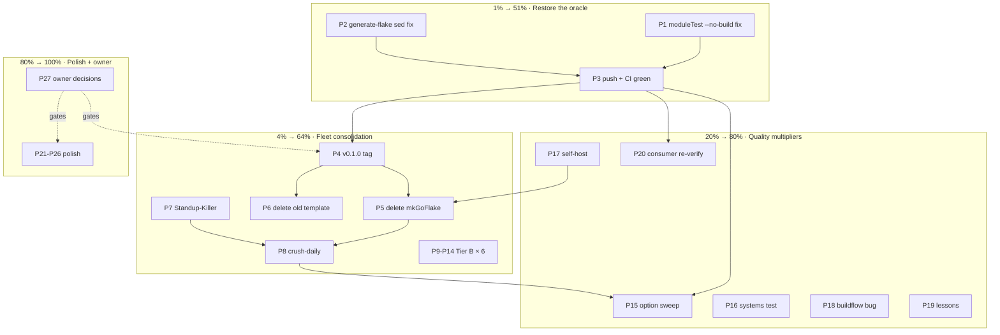

# Pareto Plan: CI-Green → Fleet Consolidation → Quality Multipliers → Polish

**Created:** 2026-09-25 09:54 CEST · **Repo state:** clean at `469e492`, ahead 3 (script SC2086 fix + status reports, unpushed)

## Context (why this plan looks like this)

Master **through `bb56b78` is on origin and CI is RED** (run 36108978307). I
reproduced all three failure causes locally before planning:

1. **`check` job (ubuntu + macos):** `nix flake check --no-build` fails at
   `test-module.nix:1136` — "while realising the context of path
   '…-source/mkPreparedSource.nix' … path is not valid". The D-tier session's
   `gnhInputs.go-nix-helpers.outPath = ./.` trick forces the working tree as
   string CONTEXT inside the moduleTest derivation; under `--no-build` (what
   CI runs) that context realisation breaks. My session's full checks ran
   WITH builds — which masked it. `old-nixpkgs-module-test` PASSED in CI (new
   guard works; only the `--no-build` path is broken).
2. **`smoke-test`:** `generate-flake.sh --private-deps` → `sed: -e expression
   #1, char 136: extra characters after command` — real latent bug, never run
   locally this session (CI-only job). Reproduces locally.
3. **`shellcheck`:** SC2086 in `check-docs-annotations.sh` — already fixed
   locally in `499187f`, just not pushed.

Everything downstream (v0.1.0 tag, mkGoFlake deletion, migrations, option
sweeps) is gated on a green oracle. Hence the 1%.

Remaining backlog sources: `TODO_LIST.md` (T4, T5, T33, T34 + Blocked),
status report `2026-09-25_09-45_*` §f (43 items), and the CI diagnosis above.

## Pareto breakdown

- **1% → 51% — Restore the oracle (CI green).** Three diagnosed fixes, then
  push. Nothing can be honestly verified or shipped until this lands; it also
  un-blocks the tag and every migration's "CI validates it" contract.
- **4% → 64% — Fleet consolidation.** v0.1.0 tag → delete mkGoFlake + old
  template → migrate Tier C (2 repos, zero mkGoFlake consumers remain) →
  migrate Tier B (6 repos). One module for the whole fleet; dead surface = 0;
  consumers gain the auto-default toolchain + floor check immediately.
- **20% → 80% — Quality multipliers.** Post-push consumer option sweep
  (goExperiment/completionStyle kills 10× boilerplate), systems-mapping module
  test, self-hosting our own flake on our own module (the dogfood gap that
  hid two dead options), buildflow nix-hash-fix bug upstream, lessons export.
- **Other 20% → 100% — Polish, verification leftovers, watchlist, owner
  decisions.** Everything small, deferred, or gated listed honestly below.

## Medium plan (30–100 min each · 27 tasks · sorted by importance → impact → effort)

| #   | Task                                                                              | Tier | Impact | Effort | Source |
| --- | --------------------------------------------------------------------------------- | ---- | ------ | ------ | ------ |
| P1  | Fix moduleTest `--no-build` path-context failure (gnhInputs `./.` in derivation strings; assert via drvAttrs or explicit filtered source) | 1% | Critical | 60m | CI diagnosis |
| P2  | Fix `generate-flake.sh --private-deps` sed expression bug + local smoke re-run | 1% | High | 30m | CI smoke-test |
| P3  | Push pending commits (SC2086 fix + reports) + watch CI to green on all jobs | 1% | Critical | 30m | report §g.1 |
| P4  | G1: cut v0.1.0 — CHANGELOG section, annotated tag, push tag, module-proxy + pkg.go.dev watch, `go get` validation | 4% | Critical | 60m | TODO Blocked |
| P5  | G2: delete `mkGoFlake.nix` + trace wrapper + structural-check/test references (post-tag) | 4% | High | 45m | TODO Blocked |
| P6  | G3: delete `templates/go-flake-parts/` + generate-flake.sh/README references (post-tag) | 4% | High | 30m | TODO Blocked |
| P7  | T5a: migrate Standup-Killer off mkGoFlake (subModules + doCheck=false) | 4% | High | 60m | TODO T5 |
| P8  | T5b: migrate crush-daily off mkGoFlake (NixOS module via perSystem) → mkGoFlake consumers = 0 | 4% | High | 90m | TODO T5 |
| P9  | T4a: migrate KeyCountdown to go-standard | 4% | Med | 60m | TODO T4 |
| P10 | T4b: migrate branching-flow (go-enum via extraBuildAttrs) | 4% | Med | 60m | TODO T4 |
| P11 | T4c: migrate StopTube (per-package attrs in anger) | 4% | Med | 75m | TODO T4 |
| P12 | T4d: migrate overview (git-hooks input consumer-side; nixosModules via perSystem) | 4% | Med | 90m | TODO T4 |
| P13 | T4e: migrate bank-sync (allowUnfree consumer-side) | 4% | Med | 60m | TODO T4 |
| P14 | T4f: migrate BuildFlow (1215 lines; multi-tool packages) | 4% | Med | 100m | TODO T4 |
| P15 | T34: consumer option sweep — GOEXPERIMENT → `goExperiment`, cobra → `completionStyle` (incl. sbts) | 20% | High | 100m | TODO T34 |
| P16 | T33: module test for the `go-standard.systems` mapping (kill manual-probe-only coverage) | 20% | Med | 45m | TODO T33 |
| P17 | Self-host: import `flakeModules.go-standard` in our own flake (close the dogfood gap) | 20% | High | 100m | report §e.3 |
| P18 | buildflow nix-hash-fix classifier bug: minimal repro + upstream issue (dependency-of-check mismatches) | 20% | Med | 60m | report §e.7 |
| P19 | Export cross-project lessons (toString-bools, tryEval-messages, `or` precedence, piped-exits) to crush-config + AGENTS pipefail recipe | 20% | Med | 30m | report §f.27-28 |
| P20 | Post-push consumer re-verify WITHOUT `--override-input` (kill the PMA-class time bomb pattern) | 20% | High | 45m | report §f.42 |
| P21 | Docs-gate extension to `docs/planning`+`docs/reviews` + vendored-from revision marker in check-rows.py | 80% | Low | 30m | report §f.32-33 |
| P22 | nix-health dirty-tree warning + dashboard.sh canary line | 80% | Low | 30m | report §f.34-35 |
| P23 | Verification leftovers: E2 derivation-level red proof, pandoc→HTML strikethrough check, F7 warning-noise observation | 80% | Low | 60m | report §b |
| P24 | F13: verify what "CV" referred to before dropping the watchlist item | 80% | Low | 30m | report §b |
| P25 | Watchlist batch: `passthru.go` parity on devShells, assertion-count emission in moduleTest output, goModFloorMessage malformed-input tests, README incompatible-systems FAQ, result* re-sweep | 80% | Low | 60m | report §f.35-40 |
| P26 | CI: `workflow_dispatch` flake-check target (host-broken oracle) + old-nixpkgs pin refresh policy note | 80% | Low | 30m | report §f.31,41 |
| P27 | Owner-decision batch: T15 verdict, G4 nixpkgs maintainer PR, G5 SSH CI secret, G6 df9a5ff rebase, G7 won't-implement policy, nix.conf auto-GC | 80% | High | 30m | report §g |

## Fine plan (≤12 min each · 106 tasks · sorted by importance within parent)

### P1 — moduleTest --no-build fix (1%)

| # | Task | Effort |
| - | ----- | ------ |
| 1.1 | Reproduce minimal: `nix flake check --no-build` fails; record exact trace frame (test-module.nix:1136) | 6m |
| 1.2 | Read test-module.nix:1130-1160 + gnhInputs block; identify every derivation-STRING interpolation of `inputs.go-nix-helpers` paths | 10m |
| 1.3 | Choose mechanism: assert against `drvAttrs`/pure values instead of interpolating store paths into buildCommand, or materialize via `builtins.filterSource` once | 10m |
| 1.4 | Implement the fix in test-module.nix (both call sites if present) | 12m |
| 1.5 | Verify: `nix flake check --no-build` green locally + `nix build .#checks.x86_64-linux.moduleTest` green | 10m |
| 1.6 | Sanity: old-nixpkgs override still green (`--override-input nixpkgs …moduleTest`) | 10m |

### P2 — generate-flake.sh sed bug (1%)

| # | Task | Effort |
| - | ----- | ------ |
| 2.1 | Locate the failing sed (char ~136) in the --private-deps path; read expression | 8m |
| 2.2 | Fix expression (quote/escape); run ALL smoke variants locally (plain, --templ, --go-mod, --private-deps, combined, --dry-run, --verbose, go-flake-parts) | 12m |
| 2.3 | shellcheck the file | 4m |

### P3 — Push + CI green (1%)

| # | Task | Effort |
| - | ----- | ------ |
| 3.1 | Commit P1+P2 fixes with detailed messages | 6m |
| 3.2 | Push master (3 pending + fixes) | 2m |
| 3.3 | `gh run watch` until all jobs green; triage any residual red immediately | 12m |

### P4 — G1 v0.1.0 release (4%)

| # | Task | Effort |
| - | ----- | ------ |
| 4.1 | Confirm CI green on release candidate commit | 5m |
| 4.2 | CHANGELOG: [Unreleased] → [0.1.0] — 2026-09-25 section header | 8m |
| 4.3 | Full local gate: flake check (builds) + verifyValidation + docs gates | 10m |
| 4.4 | Annotated tag `v0.1.0` with summary message; push tag | 8m |
| 4.5 | Watch module proxy propagation (proxy.golang.org fetch trigger) + pkg.go.dev listing | 10m |
| 4.6 | Consumer validation: `go get git+ssh…@v0.1.0` in a scratch module; record | 10m |

### P5 — G2 delete mkGoFlake (4%)

| # | Task | Effort |
| - | ----- | ------ |
| 5.1 | Delete `mkGoFlake.nix` + flake.nix `lib.mkGoFlake` trace wrapper | 6m |
| 5.2 | Update `checks.structural` (drops lib.mkGoFlake probe) + test-module mkGoFlake smoke block | 10m |
| 5.3 | Grep repo for mkGoFlake references (README, AGENTS, man, migration-guide, docs) — update all | 12m |
| 5.4 | nix fmt + flake check green | 8m |
| 5.5 | CHANGELOG Removed entry | 4m |

### P6 — G3 delete old template (4%)

| # | Task | Effort |
| - | ----- | ------ |
| 6.1 | `git rm -r templates/go-flake-parts/` | 3m |
| 6.2 | generate-flake.sh: drop go-flake-parts template branch + --list entry | 10m |
| 6.3 | README/AGENTS/migration-guide references update; CHANGELOG entry | 10m |
| 6.4 | Re-run generate-flake smoke suite | 6m |

### P7 — Standup-Killer migration (4%)

| # | Task | Effort |
| - | ----- | ------ |
| 7.1 | Read its mkGoFlake config (subModules, doCheck, deps) + consumer-audit checklist pass | 10m |
| 7.2 | Write go-standard config equivalent; remove mkGoFlake import | 12m |
| 7.3 | `nix flake check --no-build` + build package; nix-hash-fix if vendorHash moves (buildflow) | 12m |
| 7.4 | Commit (chain add+commit; daemon races) + verify clean | 6m |
| 7.5 | Record in migration matrix (TODO_LIST evidence) | 4m |

### P8 — crush-daily migration (4%)

| # | Task | Effort |
| - | ----- | ------ |
| 8.1 | Read mkGoFlake config + NixOS-module output shape | 10m |
| 8.2 | Map NixOS module via flake-parts `perSystem`/flake output pattern | 12m |
| 8.3 | go-standard config; remove mkGoFlake | 10m |
| 8.4 | Eval + build verify; nix-hash-fix if needed | 12m |
| 8.5 | Confirm `mkGoFlake` grep across fleet = 0 consumers | 6m |
| 8.6 | Commit + matrix record | 6m |

### P9–P14 — Tier B migrations (4%, per repo)

| # | Task | Effort |
| - | ----- | ------ |
| 9.1 | KeyCountdown: read config, write go-standard equiv | 12m |
| 9.2 | KeyCountdown: eval+build+commit+matrix | 12m |
| 10.1 | branching-flow: config incl. go-enum extraBuildAttrs | 12m |
| 10.2 | branching-flow: eval+build+commit+matrix | 12m |
| 11.1 | StopTube: per-package packages option mapping | 12m |
| 11.2 | StopTube: eval+build+commit+matrix | 12m |
| 12.1 | overview: git-hooks input + nixosModules mapping | 12m |
| 12.2 | overview: eval+build | 12m |
| 12.3 | overview: commit+matrix | 6m |
| 13.1 | bank-sync: allowUnfree consumer-side + config | 12m |
| 13.2 | bank-sync: eval+build+commit+matrix | 12m |
| 14.1 | BuildFlow: read 1215-line flake; inventory outputs | 12m |
| 14.2 | BuildFlow: multi-tool `packages` mapping | 12m |
| 14.3 | BuildFlow: eval verify | 12m |
| 14.4 | BuildFlow: build + nix-hash-fix | 12m |
| 14.5 | BuildFlow: commit + matrix + fleet-zero report | 8m |

### P15 — T34 consumer option sweep (20%)

| # | Task | Effort |
| - | ----- | ------ |
| 15.1 | Enumerate consumers with GOEXPERIMENT/completion boilerplate (grep fleet) | 10m |
| 15.2 | Per-repo swap: GOEXPERIMENT → `goExperiment` (incl. sbts) — 10 repos × ~8m | 12m |
| 15.3 | Cobra repos: `completionStyle = "subcommand"` | 10m |
| 15.4 | Lock bumps to ≥ pushed option rev; `nix flake check --no-build` per repo | 12m |
| 15.5 | Build-verify the two heaviest; commit per repo | 12m |
| 15.6 | Update migration guide examples to typed options | 10m |

### P16 — T33 systems module test (20%)

| # | Task | Effort |
| - | ----- | ------ |
| 16.1 | Test: eval composite mapping via stub (systems option → flake-parts systems) | 12m |
| 16.2 | Assert output system set equals configured | 10m |
| 16.3 | Wire into test-module.nix; count update; verify green | 10m |

### P17 — Self-host own flake (20%)

| # | Task | Effort |
| - | ----- | ------ |
| 17.1 | Diff hand-rolled perSystem vs module outputs (what must survive: apps.dashboard, custom checks) | 12m |
| 17.2 | Import flakeModules.go-standard; map pname/vendorHash/checks | 12m |
| 17.3 | Preserve repo-specific outputs (dashboard app, verifyValidation app, manPages, structural) | 12m |
| 17.4 | flake check (builds) green | 12m |
| 17.5 | Confirm systems/list + devShell parity; document in AGENTS | 10m |
| 17.6 | CHANGELOG entry | 4m |

### P18 — buildflow bug upstream (20%)

| # | Task | Effort |
| - | ----- | ------ |
| 18.1 | Extract minimal repro from sbts session (mismatch in dependency-of-check) | 12m |
| 18.2 | Draft issue (verify-before-filing: source-level check in BuildFlow repo) | 12m |
| 18.3 | File via gh in LarsArtmann/BuildFlow | 6m |
| 18.4 | Reference it in our AGENTS gotcha | 4m |

### P19 — Lessons export (20%)

| # | Task | Effort |
| - | ----- | ------ |
| 19.1 | crush-config repo: add 4 lessons to references/lessons.md + commit | 12m |
| 19.2 | AGENTS: pipefail/no-piped-exit verification recipe | 8m |
| 19.3 | AGENTS: `a.b or null == "x"` precedence gotcha | 6m |

### P20 — Post-push consumer re-verify (20%)

| # | Task | Effort |
| - | ----- | ------ |
| 20.1 | Pick 3 sentinel consumers (PMA, erraudit, sbts); `nix flake check --no-build` against LOCKED revs, no overrides | 12m |
| 20.2 | Build one end-to-end | 12m |
| 20.3 | Record "no --override-input needed" evidence in TODO/CHANGELOG | 6m |

### P21–P26 — Polish (80%)

| # | Task | Effort |
| - | ----- | ------ |
| 21.1 | check-docs-annotations.sh: extend scan to docs/planning + docs/reviews | 10m |
| 21.2 | check-rows.py header: vendored-from revision/date marker | 6m |
| 21.3 | Verify gates still green; commit | 6m |
| 22.1 | nix-health.sh: dirty-tree warning (daemon+GC hazard) | 10m |
| 22.2 | dashboard.sh: one-line canary summary in header | 10m |
| 22.3 | shellcheck + commit | 4m |
| 23.1 | E2 derivation-red: throwaway branch plants broken table, build check derivation, expect fail, revert | 12m |
| 23.2 | pandoc→HTML render of 5 struck tables; confirm `<del>` | 10m |
| 23.3 | Observe nixpkgs overridden-version warning gone with F7 markers | 8m |
| 23.4 | Record outcomes in report/TODO | 4m |
| 24.1 | Search repos/mail for "CV" context; determine target repo | 12m |
| 24.2 | If found: lock update + FOD build proof; else record premise-stale verdict | 10m |
| 25.1 | devShell passthru.go parity (mkShell passthru) + test | 10m |
| 25.2 | moduleTest: emit assertion count into $out for drift detection | 8m |
| 25.3 | goModFloorMessage malformed-input tests ("1.x", "v1.26", "") | 10m |
| 25.4 | README FAQ: incompatible-systems warning post-fix | 8m |
| 25.5 | result* symlink re-sweep | 4m |
| 26.1 | ci.yml: workflow_dispatch target running full check | 10m |
| 26.2 | Old-nixpkgs pin refresh policy note in ci.yml comment + TODO | 6m |

### P27 — Owner decisions (80%, gated)

| # | Task | Effort |
| - | ----- | ------ |
| 27.1 | Present batch: T15 verdict, G4-G7 go/no-go, auto-GC fix — then execute per answer | 30m |

## Execution graph

## Verification gates (per tier)

- **T1:** `nix flake check --no-build` green locally AND in CI; smoke suite green; shellcheck green.
- **T2:** per migration — eval + build green, vendorHash via buildflow when it moves, commit verified by subject; `grep -r mkGoFlake` fleet-wide = 0 at T2 exit; tag visible on proxy.golang.org.
- **T3:** moduleTest count grows with new assertions; consumer evals without `--override-input`; self-hosted flake passes its own module's checks.
- **T4:** each leftover item closes with recorded evidence (derivation-red proof, `<del>` render output, warning-noise grep).

**No Verschlimmbesserung:** deletions (P5/P6) strictly post-tag; migrations follow docs/consumer-audit-checklist.md; every fix verified before commit; no speculative rewrites.

## Sources

- `TODO_LIST.md` (post-cleanup state 2026-09-25)
- `docs/status/2026-09-25_09-45_self-review-and-comprehensive-status.md` §a–§f
- CI run `36108978307` logs + local reproduction (moduleTest trace, smoke sed error)
